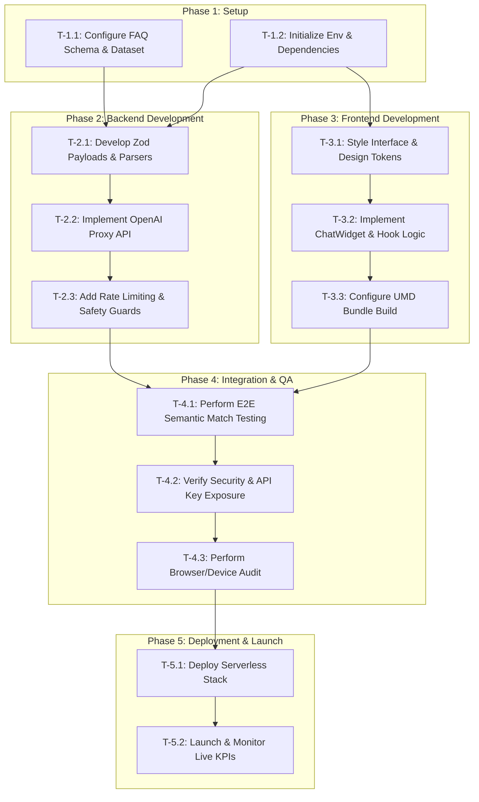

# FAQBot — Project Task Flow

This document outlines the crisp flow of development, integration, testing, and deployment tasks for **FAQBot (v1)**. It provides a structured, chronological path from setup to launch, indicating task dependencies and alignment with project KPIs.

---

## 1. Project Task Flow Diagram

The diagram below shows the sequential order and dependencies of the development phases:

---

## 2. Detailed Task Breakdown

### Phase 1: Preparation & Setup
| Task ID | Task Name | Dependencies | Description | Verification Method | Status |
| :--- | :--- | :--- | :--- | :--- | :--- |
| **T-1.1** | Configure FAQ Dataset | None | Define `faq.json` with ~20 structured Q&A pairs in the `public/` directory. | Verify JSON structure manually. | [x] Completed |
| **T-1.2** | Environment Setup | None | Configure `.env` variables (`OPENAI_API_KEY`) and prepare standard scripts in `package.json`. | Verify environment loads successfully. | [x] Completed |

---

### Phase 2: Backend API Proxy Development
| Task ID | Task Name | Dependencies | Description | Verification Method | Status |
| :--- | :--- | :--- | :--- | :--- | :--- |
| **T-2.1** | Schema Validation | T-1.1, T-1.2 | Write Zod schemas to validate `/api/chat` incoming payloads and the static `faq.json` file. | Unit tests checking rejection of invalid payloads and malformed FAQs. | [x] Completed |
| **T-2.2** | OpenAI matching | T-2.1 | Implement chat completions query with temperature 0.0 using `gpt-4o-mini` to match FAQ questions. | Verify returning answer or `"NO_MATCH"`. | [x] Completed |
| **T-2.3** | Safety & Error Guards | T-2.2 | Add error catching to return `matched: false` and the fallback message under any failure or no match. | Mock OpenAI errors to verify fallback HTTP response structure. | [x] Completed |

---

### Phase 3: Frontend Interface Development
| Task ID | Task Name | Dependencies | Description | Verification Method | Status |
| :--- | :--- | :--- | :--- | :--- | :--- |
| **T-3.1** | UI Styling Setup | T-1.2 | Set up variables and design tokens in CSS (`src/styles/index.css`) matching e-commerce branding. | Visual check of page layout and color themes. | [x] Completed |
| **T-3.2** | Widget Component | T-3.1 | Implement chat interface with message feed, input fields, character constraints (500 max), and hooks. | Interact with input component to test validation and typing indicators. | [x] Completed |
| **T-3.3** | Single UMD Bundle Config | T-3.2 | Configure Vite bundler to output a single script file to inject on any external HTML store. | Build project and ensure a single CSS/JS bundle is produced. | [x] Completed |

---

### Phase 4: Integration, QA & KPI Verification
| Task ID | Task Name | Dependencies | Description | Verification Method (KPI Match) | Status |
| :--- | :--- | :--- | :--- | :--- | :--- |
| **T-4.1** | Match Accuracy Audit | T-2.3, T-3.3 | Verify standard and edge-case questions. Check that known FAQs succeed and unrelated questions fallback. | Test known questions (KPI **F-2**: ≥ 90% accuracy) and off-scope questions (KPI **F-3**: 100% fallback). | [ ] Pending |
| **T-4.2** | Client Key Exposure Audit | T-4.1 | Inspect network transactions and compiled files to guarantee no OpenAI API keys are exposed. | Search built bundle for credentials; check browser network requests (KPI **F-4**). | [ ] Pending |
| **T-4.3** | Browser Performance Audit | T-4.2 | Test widget loading times and cross-browser responsiveness. | Verify widget load times on broadband (KPI **F-1**: ≤ 2s) and cross-browser functionality (KPI **F-5**). | [ ] Pending |

---

### Phase 5: Production Deployment & Business Tracking
| Task ID | Task Name | Dependencies | Description | Verification Method (KPI Match) | Status |
| :--- | :--- | :--- | :--- | :--- | :--- |
| **T-5.1** | Serverless Launch | T-4.3 | Deploy backend proxy and static widget bundle to production environment (Vercel/Netlify). | Access live URL, check widget rendering and active chat logs. | [ ] Pending |
| **T-5.2** | Post-Launch Audit | T-5.1 | Track real-world metrics, deflection rates, and email counts over a 30-to-60-day window. | Monitor analytics: Deflection (KPI **B-1**: ≥ 60%), Fallback (KPI **B-2**: ≤ 40%), Email reduction (KPI **B-3**: ↓ 20%). | [ ] Pending |
