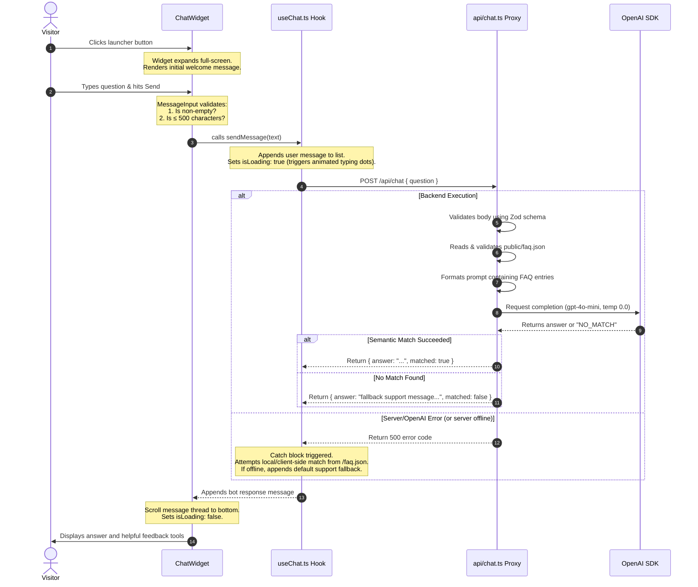

# FAQBot — Developer Onboarding & Project Workflow

Welcome to **FAQBot (v1)**! This document is designed to get any new developer up to speed on how the application is built, where the code lives, how data flows through the system, and how the core features are implemented.

---

## 1. System Architecture & High-Level Flow

FAQBot is designed as a **stateless, database-free AI chat application**. It utilizes a static FAQ database and handles natural-language semantic matching using the OpenAI API.

```mermaid
graph TD
    subgraph Client [Client Storefront Browser]
        Widget[React ChatWidget]
        LocalSim[Local /faq.json Client-Side Matcher]
    end

    subgraph Serverless [Serverless Proxy - Vercel / Netlify]
        API[api/chat.ts POST Endpoint]
        FAQStatic[public/faq.json Asset]
    end

    subgraph External [OpenAI Service]
        gpt[gpt-4o-mini completions]
    end

    Widget -->|1. HTTP POST request { question }| API
    API -->|2. Reads & Validates| FAQStatic
    API -->|3. Runs prompt constraint checks| gpt
    gpt -->|4. Matches question or returns NO_MATCH| API
    API -->|5. Returns JSON response { answer, matched }| Widget
    Widget -.->|6. If server is down, falls back to| LocalSim
```

---

## 2. Directory Map & File Roles

The codebase is split cleanly into frontend React code and serverless Node.js backend functions:

```text
FAQBot/
├── Agents/                        # Project scopes, boundaries, KPIs, and workflows
│   ├── prd.md                     # Product Requirements Document
│   ├── kpi.md                     # Success criteria and verification metrics
│   ├── project_boundary.md        # Boundary constraints for developers/agents
│   ├── project_scope.md           # Functional & non-functional requirements
│   ├── project_task_flow.md       # Chronological development checklist
│   ├── project_test_cases.md      # Testing matrix and execution results
│   └── project_workflow.md        # [THIS FILE] Technical onboarding guide
│
├── api/                           # Backend Serverless Functions
│   └── chat.ts                    # POST /api/chat matching proxy function
│
├── public/                        # Static Assets
│   ├── faq.json                   # Static JSON file holding Q&A database
│   └── index.html                 # Development hosting environment
│
├── src/                           # Frontend React Application
│   ├── components/                # Modular UI components
│   │   ├── ChatWidget.tsx         # Floating/Full-Screen Chat UI Container
│   │   ├── MessageList.tsx        # Message thread & feedback handlers
│   │   ├── MessageInput.tsx       # Text box, character countdown, & send button
│   │   └── QuickActionChips.tsx   # Helper action buttons (e.g. shipping, support)
│   ├── hooks/                     # Custom hooks
│   │   └── useChat.ts             # Message lists, input validation, and API fetch state
│   ├── styles/                    # Stylesheet assets
│   │   └── index.css              # Custom themes, Material icons, and scrollbars
│   ├── App.tsx                    # Main preview entry component
│   └── main.tsx                   # Mounting React root
```

---

## 3. End-to-End Runtime Data Flow

Here is the exact step-by-step runtime lifecycle when a visitor interacts with the chat widget:



---

## 4. In-Depth Feature Implementations

As a new developer, it is important to understand how key features are wired up:

### A. Full-Screen Chat Widget Layout
* **File Location:** [ChatWidget.tsx](FAQBot/src/components/ChatWidget.tsx)
* **How it works:**
  * The widget container takes up the full screen using the CSS classes `fixed inset-0 w-full h-full`.
  * Open/Close states are controlled by the `isOpen` variable. The transition uses standard CSS transitions:
    * **Open:** `translate-y-0 opacity-100`
    * **Closed:** `translate-y-4 opacity-0 pointer-events-none`
  * The floating action launcher button is hidden when the chat widget is active (`isOpen ? 'scale-0 opacity-0 pointer-events-none' : 'scale-100 opacity-100'`) to ensure an immersive full-screen view.

### B. Interactive Thumbs-Up / Thumbs-Down Toggles
* **File Location:** [MessageList.tsx](FAQBot/src/components/MessageList.tsx)
* **How it works:**
  * When the AI successfully matches a question, it renders a "Was this helpful?" feedback block under the text bubble.
  * Local state `feedbackStates` (`Record<string, 'up' | 'down' | null>`) tracks user feedback on a per-message basis.
  * Clicking the Thumbs-Up button executes `handleThumbsUp(msg.id)`:
    * If already liked, toggles it back to `null` (default gray border/text).
    * If inactive, sets it to `'up'`, applying active green styling (`bg-green-50 border-green-500 text-green-600`).
  * Clicking the Thumbs-Down button executes `handleThumbsDown(msg.id)`:
    * Toggles between `null` and `'down'`, applying active red styling (`bg-red-50 border-red-500 text-red-600`).

---

## 5. Developer Guide: Commands & Operations

### Local Development Setup
1. **Configure Environment:**
   * Create a `.env` file in the root directory:
     ```text
     OPENAI_API_KEY=your_openai_api_key_here
     ```
2. **Install Dependencies:**
   * Run `npm install` to set up all frontend and backend libraries (e.g. React, TypeScript, Vite, Zod, OpenAI SDK).
3. **Start Local Development Server:**
   * Run `npm run dev` to launch the Vite server (usually hosted at `http://localhost:5173`).
   * The page serves [public/index.html](FAQBot/public/index.html) which hosts the mounted React component for testing.

### Project Build & Bundling
* The widget is structured to compile into a single distributable bundle that can be easily embedded on external storefront pages.
* Execute `npm run build` to compile TypeScript and run the Vite bundler.
* Output files will be generated in the `dist/` folder.
